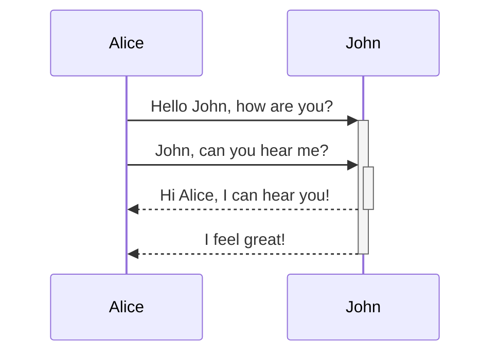
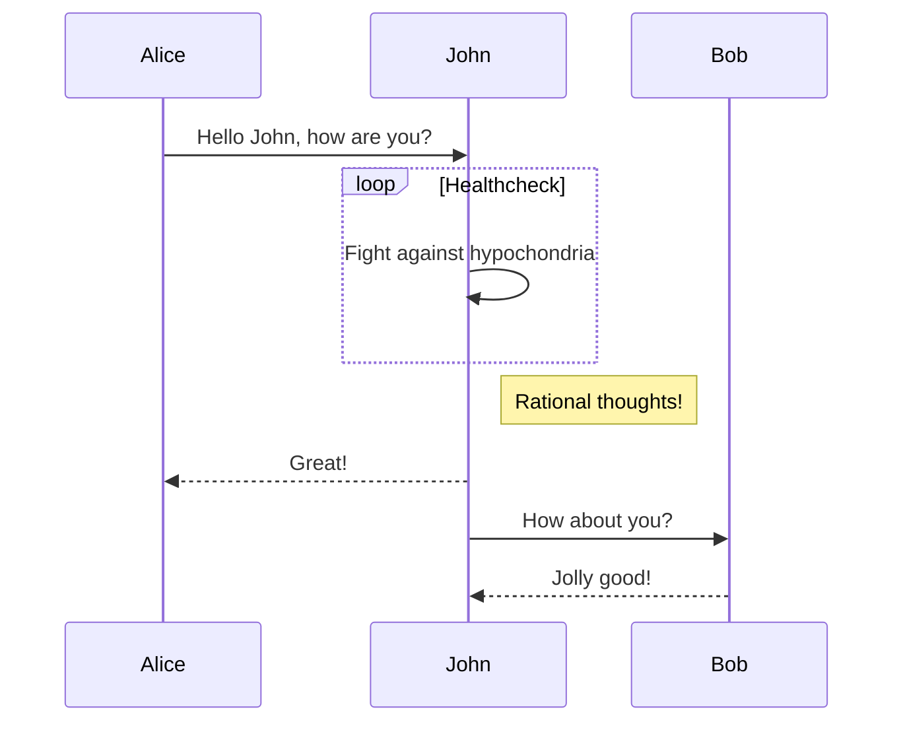
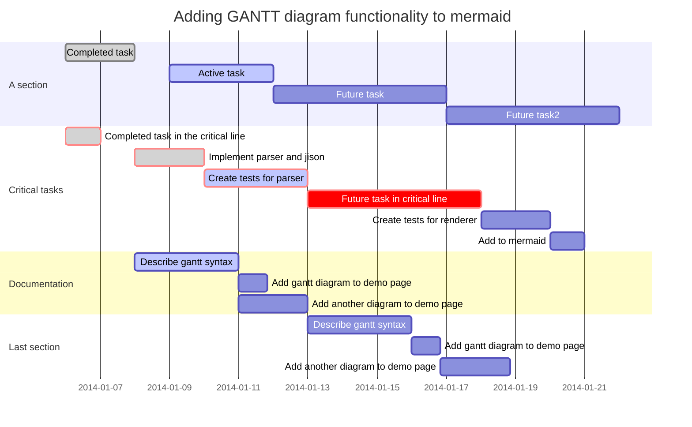
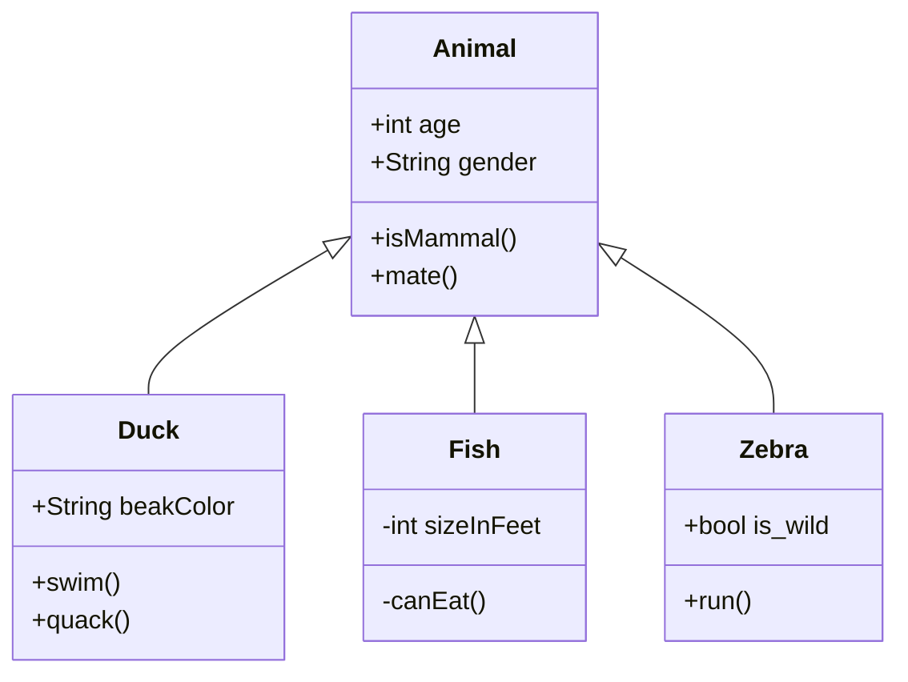
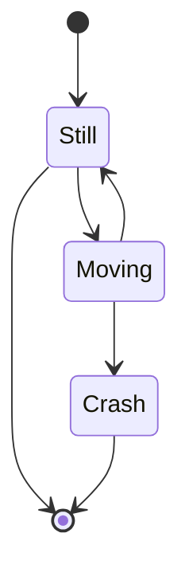
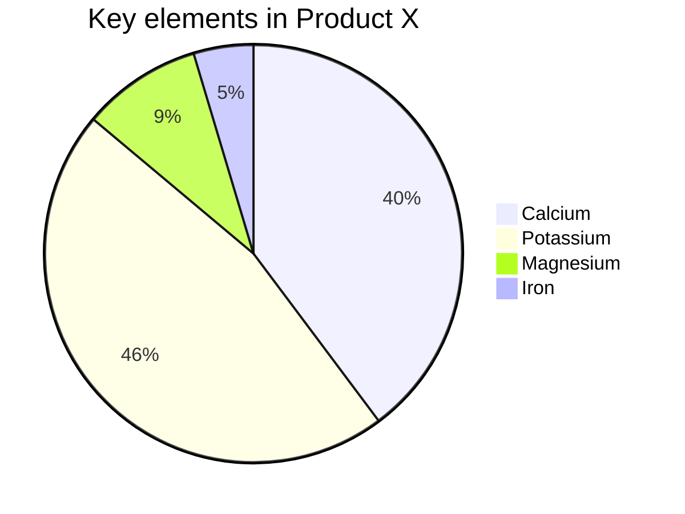
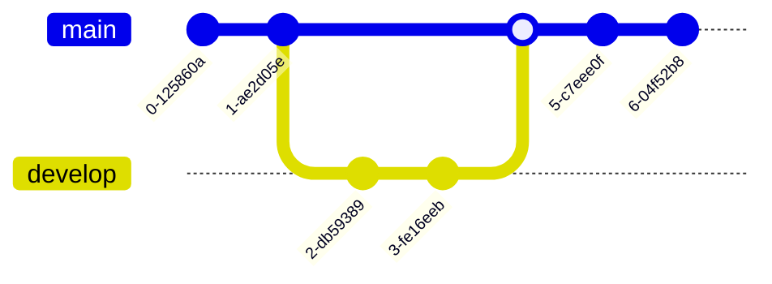
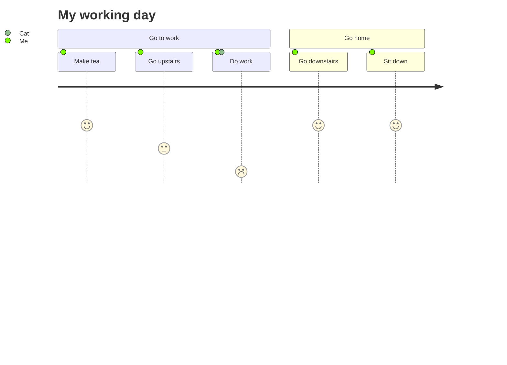
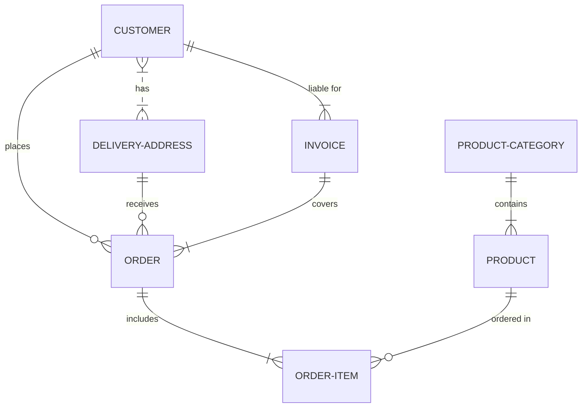

# Mermaid Tests

This is a test page for mermaid diagrams.

## Flowchart

## Sequence Diagrams

### From Live Editor

### With loop

## Gantt Diagram

## Class Diagram

## State Diagram

## Pie Chart

## Git Graph

## User Journey

## Entity Relationship Diagram

